# 🌸 Scentified — E-Commerce Perfume Website

<p align="center">
  
</p>

<p align="center">
  <strong>A PHP-based e-commerce website for browsing and purchasing perfumes online.</strong>
</p>

<p align="center">


</p>

---

## 📌 About The Project

**Scentified** is a PHP-based e-commerce perfume website designed to provide customers with an online shopping experience for fragrance products.

The system allows customers to:

- Browse available perfumes
- View product information and pricing
- Register an account
- Log in securely
- Add products to their shopping cart
- Adjust product quantities
- View dynamically updated cart totals
- Proceed through checkout
- Select a payment method
- Place orders
- View their order history
- Track their order status
- Send inquiries through the Contact Us page
- Read frequently asked questions

The project also includes an **Admin Dashboard** focused on sales monitoring, order management, and data analytics.

---

# 🔄 System Workflow

The following workflow shows the complete customer journey through the Scentified e-commerce system.

```text
                    ┌──────────────────────┐
                    │      Landing Page    │
                    │      index.php       │
                    └──────────┬───────────┘
                               │
                               ▼
                    ┌──────────────────────┐
                    │      Login Page      │
                    │      login.php       │
                    └──────────┬───────────┘
                               │
                    ┌──────────┴──────────┐
                    │                     │
                    ▼                     ▼
             Existing Account       New Customer
                    │                     │
                    │                     ▼
                    │              ┌──────────────┐
                    │              │ Registration │
                    │              │ register.php │
                    │              └──────┬───────┘
                    │                     │
                    │                     ▼
                    │              Account Created
                    │                     │
                    └──────────┬──────────┘
                               ▼
                       ┌───────────────┐
                       │   Home Page   │
                       │   home.php    │
                       └───────┬───────┘
                               │
              ┌────────────────┼────────────────┐
              │                │                │
              ▼                ▼                ▼
         About Us          Contact Us          FAQs
              │                │                │
              └────────────────┼────────────────┘
                               │
                               ▼
                       ┌───────────────┐
                       │   Shop Page   │
                       │   shop.php    │
                       └───────┬───────┘
                               │
                               ▼
                       Add Products
                               │
                               ▼
                       Shopping Cart
                               │
                               ▼
                    Proceed to Checkout
                               │
                               ▼
                       ┌───────────────┐
                       │   Checkout    │
                       │ checkout.php  │
                       └───────┬───────┘
                               │
                               ▼
                         Place Order
                               │
                               ▼
                    ┌──────────────────┐
                    │  Order History   │
                    │order_history.php │
                    └────────┬─────────┘
                             │
                             ▼
                       View Order Status
````

### 🔎 Customer Process

1. Customer enters the Scentified website.
2. Customer is directed to the Login page.
3. New customers register an account.
4. Registered customers log in using their email or username and password.
5. Customer enters the Home page.
6. Customer can browse the About Us, Contact Us, and FAQ pages.
7. Customer enters the Shop page.
8. Customer selects perfume products.
9. Products are added to the shopping cart.
10. Customer adjusts product quantities.
11. Cart totals are automatically updated.
12. Customer proceeds to Checkout.
13. Customer confirms billing and payment information.
14. Customer places the order.
15. Customer is redirected to Order History.
16. Customer can monitor the status of their order.

---

## ✨ Features

### 👤 Customer Features

* 🔐 User Registration
* 🔑 User Login
* 🚪 Logout
* 🛒 Shopping Cart
* ➕ Increase Product Quantity
* ➖ Decrease Product Quantity
* 🗑️ Remove Products from Cart
* 💰 Automatic Cart Total Calculation
* 📦 Checkout
* 💳 Multiple Payment Methods
* 🧾 Order Placement
* 📜 Order History
* 🚚 Order Status Tracking
* 📩 Contact / Inquiry Form
* ❓ Frequently Asked Questions
* ℹ️ About Us Page

---

# 🔐 Login & Registration

Customers must authenticate before accessing the shopping features.

### 🔑 Login

Customers can log in using their **email address or username** and password.

<p align="center">
  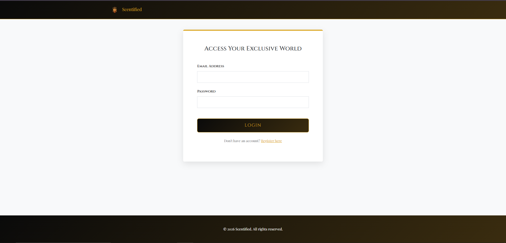
</p>

---

### 📝 Registration

New customers can create an account through the Registration page.

<p align="center">
  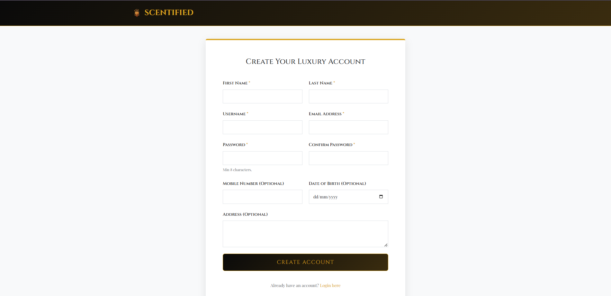
</p>

During registration, customers provide:

* First Name
* Last Name
* Username
* Email
* Password
* Confirm Password
* Mobile Number
* Address
* Date of Birth

Passwords are stored using password hashing rather than plain-text passwords.

---

# 🏠 Home Page

After successfully logging in, customers are redirected to the Scentified Home page.

<p align="center">
  
</p>

<p align="center">
  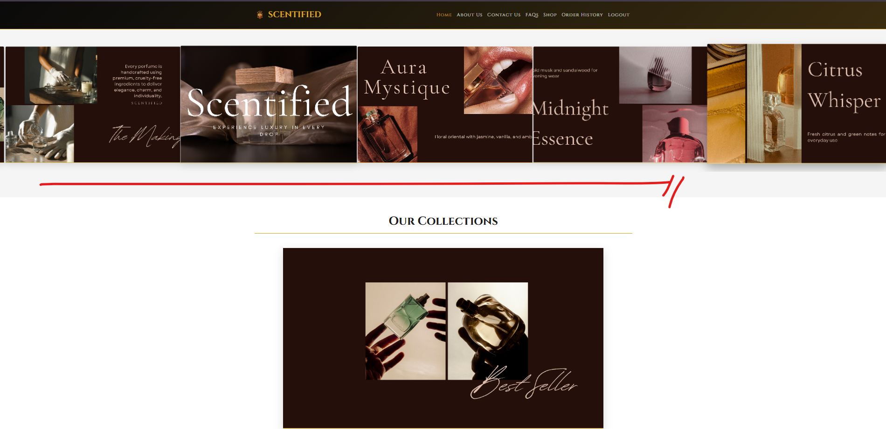
</p>

<p align="center">
  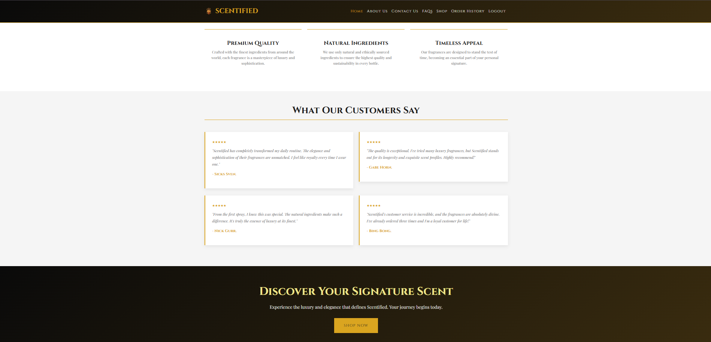
</p>

The Home page provides information about Scentified, its perfume products, and the overall shopping experience.

---

# ℹ️ About Us

Customers can learn more about Scentified through the About Us page.

<p align="center">
  
</p>

---

# 📩 Contact Us

Customers can send inquiries through the Contact Us page.

<p align="center">
  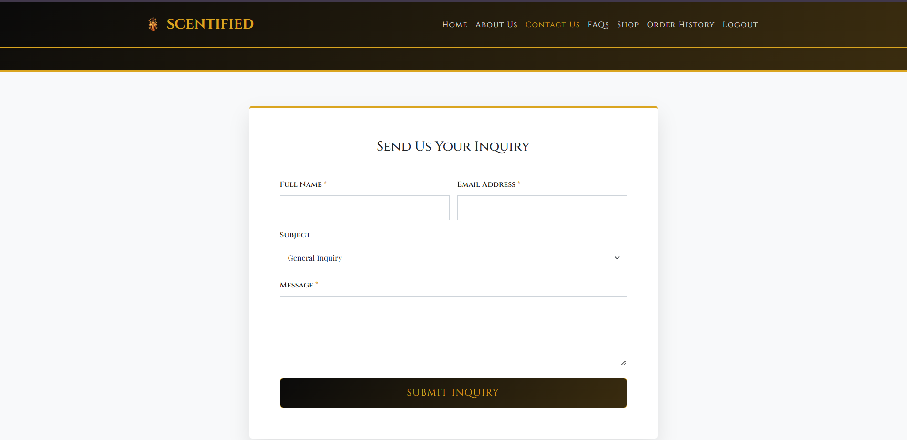
</p>

Customers can provide their information, select a subject, and submit their message.

Contact messages are stored in the database through the `contact_messages` table.

---

# ❓ Frequently Asked Questions

The FAQ page provides customers with commonly asked questions and answers about Scentified.

<p align="center">
  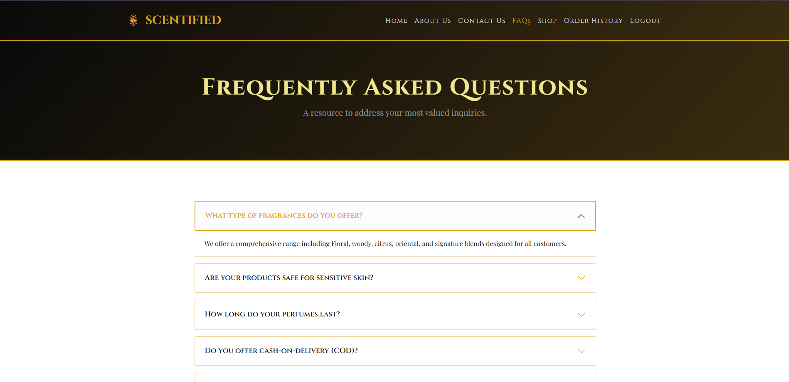
</p>

---

# 🛍️ Shopping System

Customers can browse the available perfume products through the Shop page.

<p align="center">
  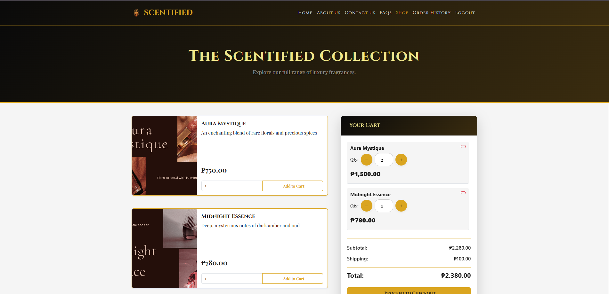
</p>

Each product contains:

* Product name
* Product description
* Product image
* Product price
* Available stock

Customers can add products to their cart and specify the quantity they want to purchase.

The shopping cart automatically updates when:

* A product is added
* A product is removed
* Product quantity is increased
* Product quantity is decreased

---

# 💳 Checkout System

Once customers finish shopping, they can proceed to Checkout.

<p align="center">
  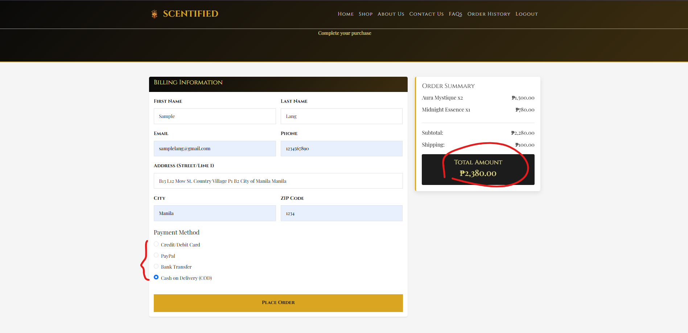
</p>

The Checkout page allows customers to confirm their billing information before placing an order.

### Billing Information

* First Name
* Last Name
* Email
* Phone Number
* Address
* City
* ZIP Code

### Payment

Customers can select their preferred payment method.

The right side of the page displays an **Order Summary** containing the selected products, quantities, prices, shipping fee, and total amount.

After confirming the information, the customer can click:

**Place Order**

The customer is then redirected to the **Order History** page.

---

# 📦 Order History

After placing an order, customers can view their previous purchases through the Order History page.

<p align="center">
  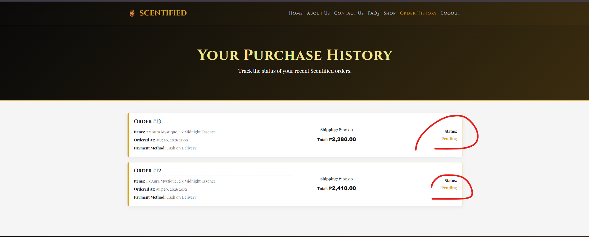
</p>

The system displays:

* Order ID
* Order total
* Payment method
* Order date
* Order status

Order statuses include:

```text
🟡 Pending
🟢 Delivered
```

The order status is updated by the administrator.

---

# 🛡️ User Authentication & Security

Scentified requires customers to create an account before purchasing products.

The registration system includes:

* First Name
* Last Name
* Username
* Email
* Password
* Confirm Password
* Mobile Number
* Address
* Date of Birth

The project implements basic security practices including:

* Password hashing using PHP `password_hash()`
* Password verification using `password_verify()`
* Session-based authentication
* Protected pages
* Server-side validation
* Client-side validation
* Duplicate username prevention
* Duplicate email prevention
* Database constraints

---
# 👑 Admin Dashboard

Scentified includes an administrative dashboard designed not only for order management but also for **sales monitoring, performance tracking, and data analysis**.

### 📊 Admin Dashboard Overview

<p align="center">
  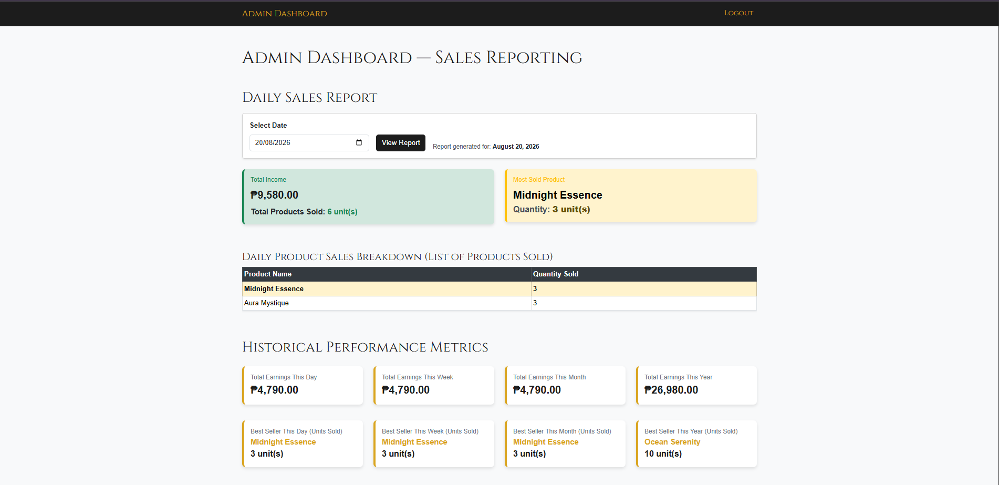
</p>

**Admin Dashboard Overview** — Provides an overall view of the system's sales performance, including total income, daily sales, historical performance, and other key business metrics.

---

### 📈 Sales & Performance Analytics

<p align="center">
  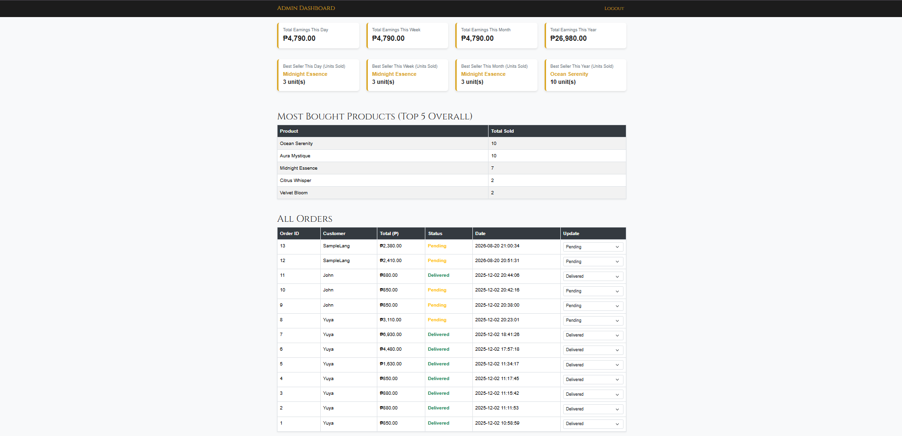
</p>

**Sales & Performance Analytics** — Displays sales-related information that helps the administrator monitor the store's financial performance and identify sales trends.

The dashboard can provide information such as:

- 💰 Total Income
- 📅 Daily Sales
- 📊 Historical Sales Performance
- 📦 Daily Product Sales
- 🏆 Best-Selling Products

---

### 🏆 Product Sales Analytics

<p align="center">
  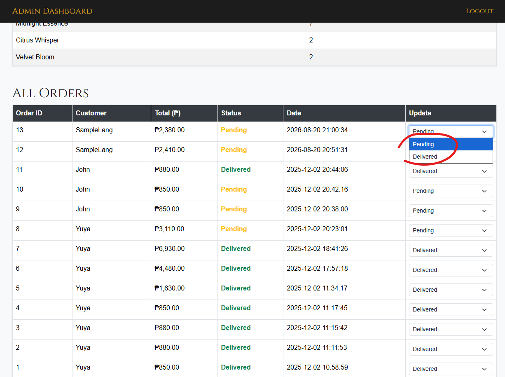
</p>

**Product Sales Analytics** — Shows the performance of individual perfume products and helps the administrator determine which products are purchased most frequently.

The administrator can analyze:

- Top 5 Most Bought Products
- Product Sales Breakdown
- Quantity Sold
- Product Performance
- Most Popular Perfume Products

This allows the administrator to identify which products are performing well and which products may require additional attention.

---

### 📋 Order Management

<p align="center">
  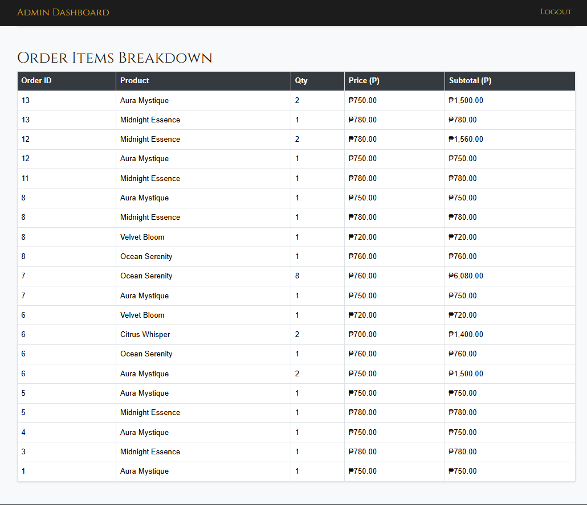
</p>

**Order Management** — Allows the administrator to view and manage customer orders.

The order management section displays:

- 🆔 Order ID
- 👤 Customer
- 💰 Total Amount
- 📦 Order Status
- 📅 Order Date
- 🛍️ Order Items Breakdown

The administrator can update the order status using the dropdown menu:

```text
Pending → Delivered
```

Once updated, the customer can see the new status through their **Order History** page.

---

# 🔄 Admin Workflow

The administrator has a separate workflow focused on **sales analytics and order management**.

```text
                    ┌──────────────────────┐
                    │      Login Page      │
                    │      login.php       │
                    └──────────┬───────────┘
                               │
                               ▼
                    ┌──────────────────────┐
                    │ Admin Authentication │
                    └──────────┬───────────┘
                               │
                               ▼
                    ┌──────────────────────┐
                    │  Admin Dashboard    │
                    │     admin.php       │
                    └──────────┬───────────┘
                               │
            ┌──────────────────┼───────────────────┐
            │                  │                   │
            ▼                  ▼                   ▼
     Sales Analytics     Order Management    Product Analytics
            │                  │                   │
            ▼                  ▼                   ▼
      Daily Sales         All Orders        Product Sales
      Total Income        Customer Info     Most Sold Product
      Historical Data     Order Total       Top 5 Products
                          Order Status      Sales Breakdown
                               │
                               ▼
                       Update Order Status
                               │
                               ▼
                       Pending → Delivered
                               │
                               ▼
                    Customer Order History
                               │
                               ▼
                     Updated Order Status
```

### 📊 Admin Process

1. Administrator enters the Login page.
2. Administrator authenticates using the admin account.
3. Administrator enters the Admin Dashboard.
4. Dashboard displays sales and business performance information.
5. Administrator reviews daily and historical sales.
6. Administrator checks total income.
7. Administrator identifies the most sold products.
8. Administrator reviews the Top 5 Most Bought Products.
9. Administrator reviews the daily product sales breakdown.
10. Administrator reviews all customer orders.
11. Administrator checks order information and status.
12. Administrator can change the order status.
13. Customer sees the updated order status in Order History.

---

# 📊 Admin Analytics

The Admin Dashboard is one of the major components of the Scentified system.

Instead of functioning only as an order management page, the dashboard provides a basic **business intelligence and data analytics perspective**.

The administrator can use the available information to understand:

```text
Sales Performance
       ↓
Revenue
       ↓
Product Performance
       ↓
Customer Orders
       ↓
Most Purchased Products
       ↓
Business Trends
```

This provides the administrator with a centralized overview of the store's performance.

---

# 🗄️ Database Structure

Scentified uses **MySQL/MariaDB** through XAMPP.

Database:

```text
scentified_db
```

### Tables

```text
scentified_db
│
├── users
│
├── products
│
├── orders
│
├── order_items
│
└── contact_messages
```

### Relationships

```text
users
  │
  │ 1
  │
  │ N
  ▼
orders
  │
  │ 1
  │
  │ N
  ▼
order_items
  │
  │ N
  │
  │ 1
  ▼
products
```

The `users` table is related to `orders`.

The `orders` table is related to `order_items`.

The `order_items` table connects individual orders with the products purchased.

---

# 📁 Project Structure

```text
scentified/
│
├── screenshots/
│   ├── index.png
│   ├── login.png
│   ├── register.png
│   ├── Home1.png
│   ├── Home2.png
│   ├── Home3.png
│   ├── AboutUs.png
│   ├── Contact.png
│   ├── FAQS.png
│   ├── Shop1.png
│   ├── Checkout.png
│   ├── Order_History.png
│   └── admin1.png
│
├── index.php
├── home.php
├── login.php
├── logout.php
├── register.php
├── shop.php
├── checkout.php
├── order_history.php
├── about.php
├── contact.php
├── faqs.php
├── admin.php
├── config.php
├── hash.php
│
├── scentified_db.sql
│
└── README.md
```

---

# ⚙️ Technologies

| Technology    | Purpose                                  |
| ------------- | ---------------------------------------- |
| PHP           | Backend and server-side processing       |
| HTML5         | Website structure                        |
| CSS3          | Website styling                          |
| JavaScript    | Client-side functionality and validation |
| Bootstrap     | Responsive UI components                 |
| MySQL/MariaDB | Database management                      |
| XAMPP         | Local PHP and MySQL server               |
| VS Code       | Development environment                  |

---

# 🚀 Installation

## Requirements

* XAMPP
* PHP
* MySQL/MariaDB
* Web Browser
* Git (optional)

---

## 1. Clone or Download

Clone the repository:

```bash
git clone https://github.com/YOUR-USERNAME/YOUR-REPOSITORY.git
```

Or download the project as a ZIP file.

---

## 2. Move the Project

Place the project inside XAMPP's `htdocs` folder:

```text
C:\xampp\htdocs\scentified
```

---

## 3. Start XAMPP

Open the XAMPP Control Panel and start:

```text
Apache
MySQL
```

---

## 4. Create the Database

Open:

```text
http://localhost/phpmyadmin
```

Create/import the database:

```text
scentified_db
```

Then import the provided:

```text
scentified_db.sql
```

---

## 5. Run the Website

Open your browser and go to:

```text
http://localhost/scentified/
```

---

# 🔑 Demo Administrator Account

For demonstration purposes, the project includes an administrator account:

```text
Email: admin@scentified.com
Password: admin123
```

> **Note:** This account is intended for local/demo purposes. Do not use this password for a real production deployment.

---

# 🧪 Development Environment

The project was developed using:

```text
Frontend:
HTML
CSS
JavaScript
Bootstrap

Backend:
PHP

Database:
MySQL / MariaDB

Local Server:
XAMPP

Code Editor:
Visual Studio Code
```

---

# 📌 Project Pages

| File                | Purpose                            |
| ------------------- | ---------------------------------- |
| `index.php`         | Landing page                       |
| `login.php`         | User authentication                |
| `register.php`      | User registration                  |
| `home.php`          | Customer home page                 |
| `shop.php`          | Product browsing and shopping cart |
| `checkout.php`      | Checkout and order placement       |
| `order_history.php` | Customer order history             |
| `about.php`         | About Us page                      |
| `contact.php`       | Customer inquiries                 |
| `faqs.php`          | Frequently Asked Questions         |
| `admin.php`         | Admin Dashboard                    |
| `logout.php`        | Logout/session termination         |
| `config.php`        | Database configuration             |
| `hash.php`          | Password hash utility              |

---

# 🔮 Future Improvements

Possible future improvements include:

* 📦 Product management for administrators
* 📊 Advanced sales charts
* 📈 More detailed business analytics
* 📁 Export reports to Excel/CSV
* ⭐ Product reviews and ratings
* ❤️ Wishlist functionality
* 🎟️ Discount and voucher system
* 📧 Email order notifications
* 👤 Customer profile management
* 📦 Inventory management
* 🔎 Product search and filtering
* 💳 Additional payment gateway integrations
* 📱 Improved mobile responsiveness

---

# 📸 Screenshots

All project screenshots are available in the [`screenshots`](scentified/screenshots/) directory.

### Customer Interface

<p align="center">
  
</p>

<p align="center">
  
</p>

<p align="center">
  
</p>

<p align="center">
  
</p>

<p align="center">
  
</p>

<p align="center">
  
</p>

### Administrator Interface

<p align="center">
  
</p>

<p align="center">
  
</p>

<p align="center">
  
</p>

<p align="center">
  
</p>

---

# 🎯 Project Purpose

Scentified was developed as an **academic e-commerce web development project** to demonstrate the integration of:

**PHP + HTML + CSS + JavaScript + MySQL + Authentication + E-Commerce + Data Analytics**

The project demonstrates how a traditional online shopping system can be combined with an administrative dashboard that provides useful sales and product performance information.

---

# 👨‍💻 Author

**Yuya Kurose**

Bachelor of Science in Information Systems (BSIS)

---

# 📄 License

This project is available for **educational and personal use**.

You are allowed to:

* Use the source code
* Copy the source code
* Modify the source code
* Learn from the project
* Use it as a reference for your own projects

If you use significant portions of this project, **please give appropriate credit to the original author.**

See the [`LICENSE`](LICENSE) file for the complete terms.

---

# ⭐ Support

If you find this project useful or interesting, consider giving the repository a ⭐ on GitHub.

---

<p align="center">
  <strong>🌸 Scentified — E-Commerce Perfume Website</strong>
</p>

<p align="center">
  Built with PHP, MySQL, HTML, CSS & JavaScript.
</p>
```

